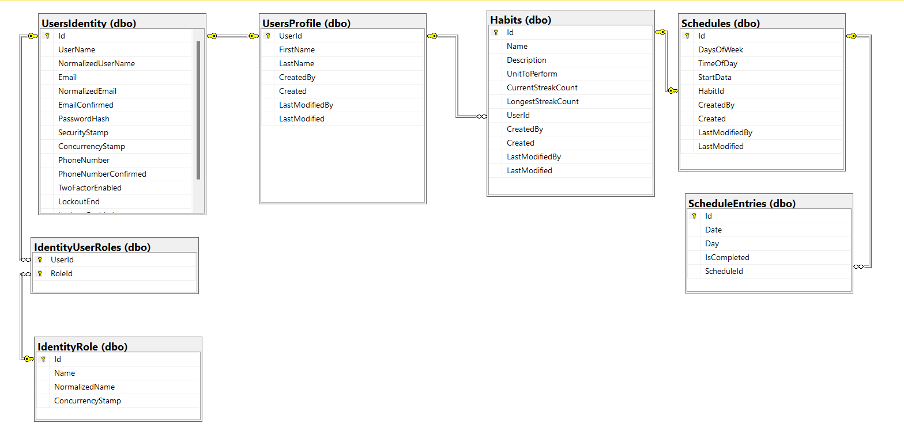

# HabitTracker - system for managing and implementing habits.

1. Change connection parameters in WebApi for sql server: WebApi/appsettings.json:  `DefaultConnection": "secret.json"`

2. Change the key to the jwt section in WebApi/appsettings.json:   `Key": "secret.json"`

3. Run commands in the WebApi project:

`dotnet restore`

`dotnet ef database update`

## Default Roles
Default Roles are as follows.
- Admin
- User
## Default credentials
- Admin - admin@admin.com / Password - Test123!@#
- User - user@user.com  / Password - Test123!@#

## Database

## API endpoints
 
 
## Features
- [x] Onion Architecture
- [x] CQRS with MediatR
- [x] MediatR Pipeline Logging & Validation
- [x] MediatR Notification
- [x] Entity Framework Core - Code First
- [x] Repository Pattern
- [x] Fluent Validation
- [x] Automapper
- [x] SMTP - EmailService
- [x] BackgroundJob - Hangfire
- [x] Microsoft Identity (Users/Role/UserInRoles)
- [x] Role based Authorization
- [x] User Management Module (register / generate token)
- [ ] Redis Caching
- [x] InMemory Caching
- [x] SQL Server Database
- [x] Seeding Users
- [x] Custom Exception Handling Middlewares
- [ ] API Versioning
- [x] Pagination
- [ ] Serilog/NLog
- [x] Swagger UI
- [x] Response Wrappers
- [x] Unit tests (Moq, Fluent Assertions, Bogus)
- [ ] Integrated tests
